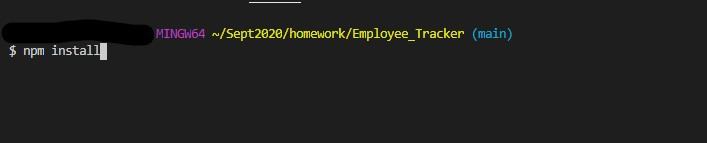
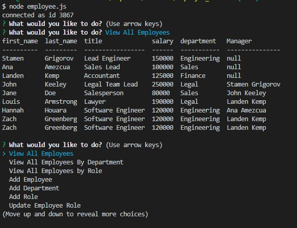

# Employee Tracker

## Description
This application is a Content Management System Interface to view and change employee and department information stored in a database. 

## Table of Content

- [Installation](#installation)
- [Dependencies](#dependencies)
- [Contributors](#contributors)
- [Author](#author)
- [Images](#images)
- [Demo](#demo)
- [Copyright](#copyright)

### Installation

The user will need to install the dependent node packages by running npm install

### Dependencies

- mysql
- inquirer
- console.table

### Contributors

zach-greenberg

### Licence

This project is licensed under the MIT- License

### Author

Zach Greenberg

### Images

### Demo

#### CopyRight

Copyright 2020 &copy; Zach Greenberg